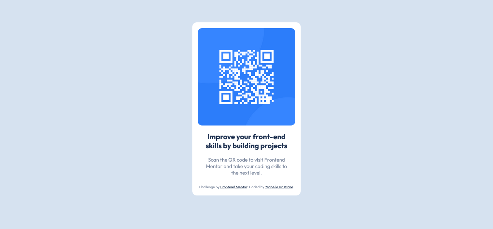

<h1 align="center"> QR Code Component </h1>

  <a href="#-projeto">Projeto</a>&nbsp;&nbsp;&nbsp;|&nbsp;&nbsp;&nbsp;
  <a href="#-tecnologias">Tecnologias</a>

 

  

## 🔖 Projeto

O QR Code Component é um projeto feito para o desafio do Frontend Mentor.

## 💻 Tecnologias

Esse projeto foi desenvolvido com as seguintes tecnologias:

- HTML e SASS

